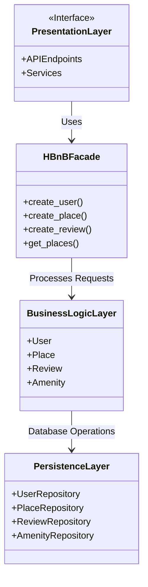
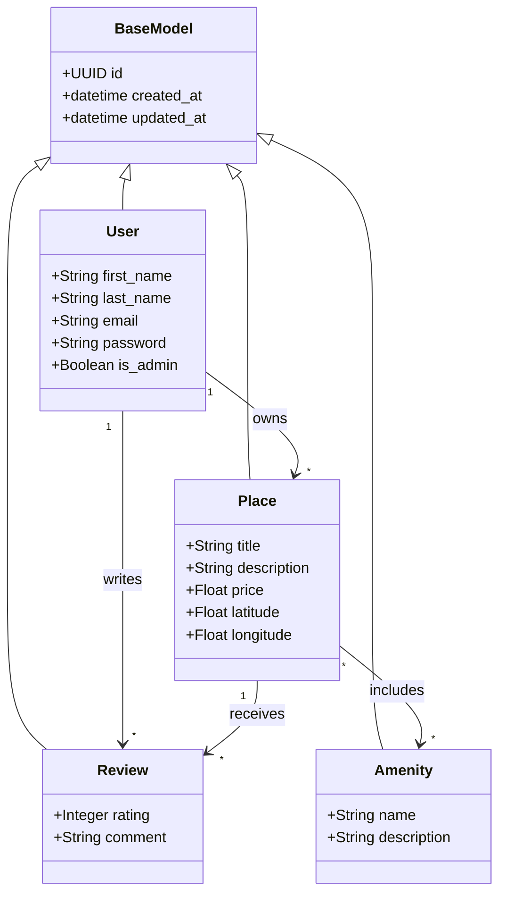
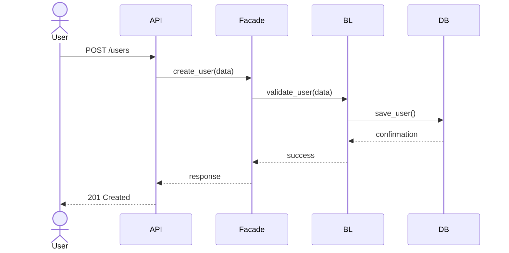
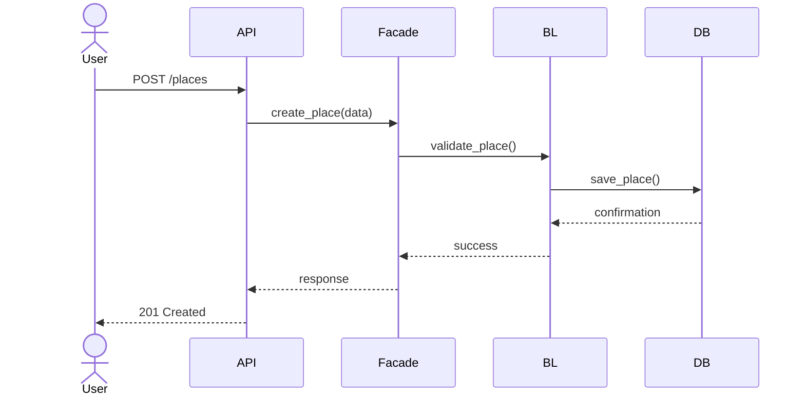
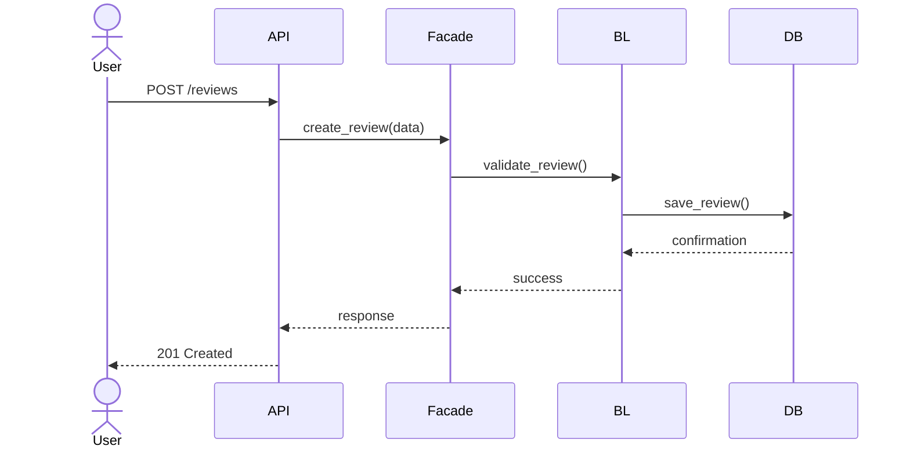
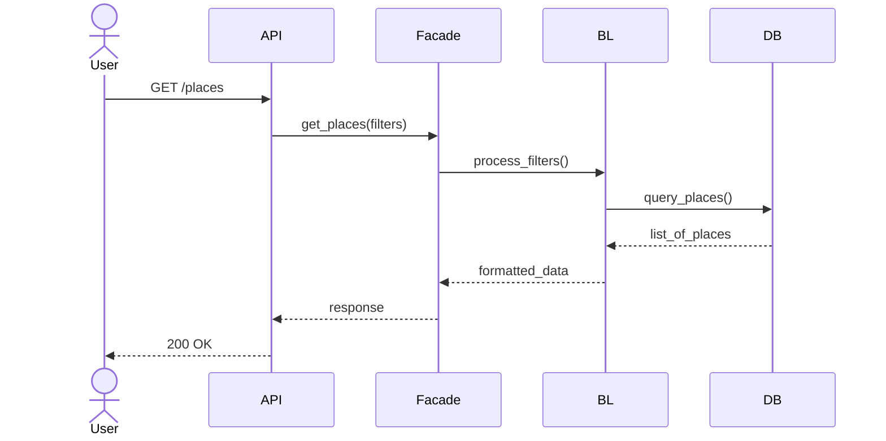

# HBnB Evolution - Technical Documentation

## 1. Introduction

### Project Overview

HBnB Evolution is a simplified backend system inspired by Airbnb. The system allows users to register, manage property listings (places), write reviews, and interact with amenities.

The application is designed using a **layered architecture** and follows **SOLID principles** to ensure scalability, maintainability, and separation of concerns.

### Purpose of This Document

This document serves as a **technical blueprint** for the system. It provides:

- High-level architecture design
- Detailed business logic structure
- API interaction flows using sequence diagrams

It will guide the implementation of the system in later project phases.

---

# 2. High-Level Architecture

## 2.1 Overview

The system is structured into **three main layers**:

1. Presentation Layer (API / Services)
2. Business Logic Layer (Core Models)
3. Persistence Layer (Database)

Communication between layers is managed using a **Facade Pattern**, which simplifies interactions and reduces coupling.

---

## 2.2 Package Diagram

---

## 2.3 Explanation

### Presentation Layer
Handles external communication:
- REST API endpoints
- Input validation
- Request/response handling

### Business Logic Layer
Contains core system rules:
- User management
- Place management
- Review system
- Amenity management

### Persistence Layer
Responsible for data storage:
- CRUD operations
- Database interactions

### Facade Pattern
The `HBnBFacade` acts as a unified interface that:
- Simplifies communication
- Reduces dependency between layers
- Centralizes business operations

---

# 3. Business Logic Layer

## 3.1 Class Diagram

---

## 3.2 Explanation

### BaseModel
Provides shared attributes:
- Unique ID (UUID4)
- Creation timestamp
- Update timestamp

Used to ensure consistency across all entities.

---

### User Entity
Represents system users.

Key responsibilities:
- Account management
- Authentication data
- Ownership of places and reviews

---

### Place Entity
Represents property listings.

Key responsibilities:
- Store location and pricing
- Link to owner (User)
- Hold reviews and amenities

---

### Review Entity
Represents user feedback.

Key responsibilities:
- Rating system (1–5)
- Comments on places
- Linked to both User and Place

---

### Amenity Entity
Represents features of a place.

Key responsibilities:
- Describe available facilities
- Shared across multiple places

---

# 4. API Interaction Flow

## 4.1 Overview

This section shows how requests flow through the system using sequence diagrams.

Each request follows this pattern:

**User → API → Facade → Business Logic → Persistence → Response**

---

## 4.2 User Registration

### Explanation
- User submits registration form
- System validates input
- Data stored in database
- Confirmation returned

---

## 4.3 Place Creation

### Explanation
- User creates property listing
- Business logic validates constraints
- Place stored in database

---

## 4.4 Review Submission

### Explanation
- User submits review
- Rating validation occurs
- Review stored in database

---

## 4.5 Fetch Places

### Explanation
- User requests list of places
- Filters applied in business layer
- Results returned from database

---

# 5. Conclusion

This document provides a complete blueprint of the HBnB Evolution system, including:

- Layered architecture design
- Business logic structure
- API interaction flows

It ensures:
- Clear separation of concerns
- Scalable system design
- Maintainable architecture

This will serve as the foundation for implementation in later phases.

---
