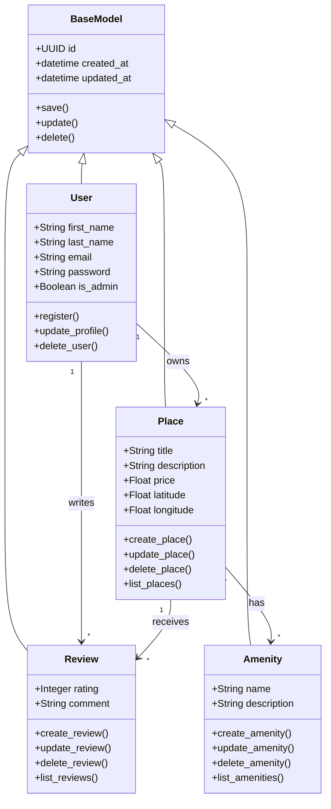

# Detailed Class Diagram - Business Logic Layer

## Overview

This diagram represents the core business entities of the HBnB Evolution application and the relationships between them.

---

## Class Diagram

