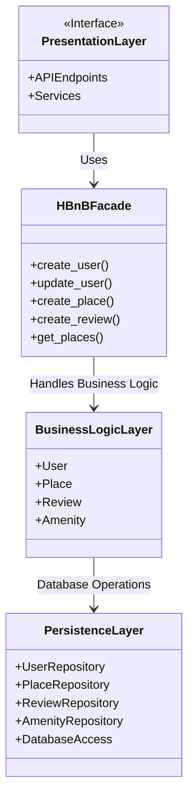

# High-Level Package Diagram - HBnB Evolution

## Overview

The HBnB Evolution application follows a three-layer architecture:

1. Presentation Layer
2. Business Logic Layer
3. Persistence Layer

The application uses the Facade Pattern to simplify communication between the presentation layer and the business logic layer.

---

## Package Diagram

