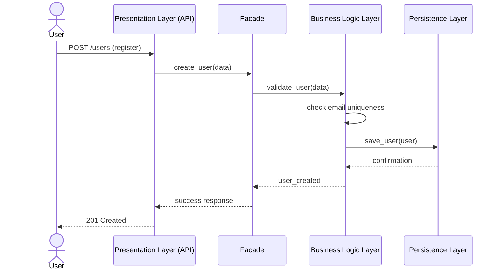
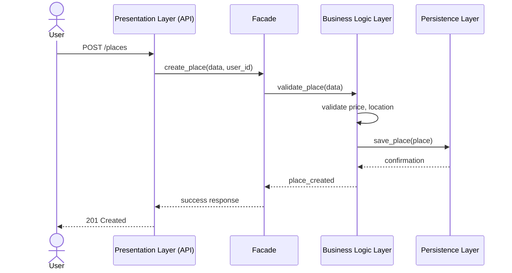
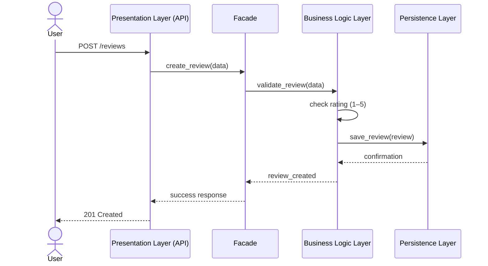
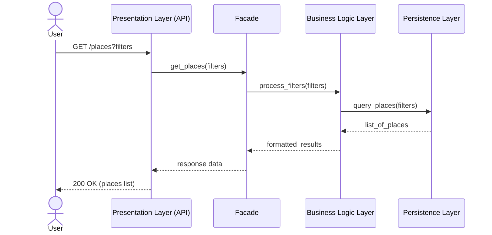

# HBnB Evolution - Sequence Diagrams (API Calls)

This document contains sequence diagrams for key API interactions in the HBnB application, showing communication between:

- Presentation Layer (API / Services)
- Facade
- Business Logic Layer
- Persistence Layer

---

# 1. User Registration

## Description
A new user registers by providing personal details. The system validates and stores the user.



---

# 2. Place Creation

## Description
A logged-in user creates a new place listing.



---

# 3. Review Submission

## Description
A user submits a review for a place they visited.



---

# 4. Fetch List of Places

## Description
A user requests a list of places (optionally filtered).



---

# Explanatory Notes

## 1. User Registration
- User sends registration request
- API forwards to Facade
- Business layer validates and checks uniqueness
- Data is stored in persistence layer
- Response is returned back through all layers

---

## 2. Place Creation
- User creates a property listing
- Business logic validates price and coordinates
- Place is saved in database
- Confirmation is returned

---

## 3. Review Submission
- User submits rating + comment
- Business logic ensures rating validity (1–5)
- Review stored in database

---

## 4. Fetching Places
- User requests list of places
- Filters processed in business layer
- Database returns matching results
- Results formatted and returned

---

# Key Architectural Flow

✔ Presentation Layer → receives API calls  
✔ Facade → central communication point  
✔ Business Logic → validation + rules  
✔ Persistence Layer → database operations  

---

# Suggested File Structure

```text id="seq-folder-001"
holbertonschool-hbnb/
└── part1/
    ├── high_level_package_diagram.md
    ├── business_logic_class_diagram.md
    ├── sequence_diagrams.md
    └── README.md
```

---

If you want, I can also:
- convert this into a **PDF report for submission**
- or draw a **clean draw.io version**
- or help you prepare for **manual QA review questions**
